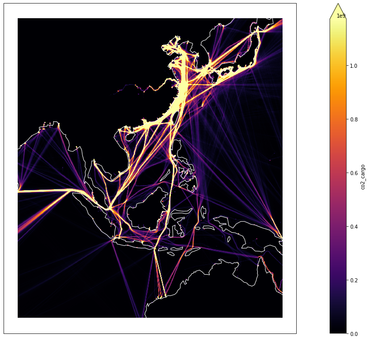
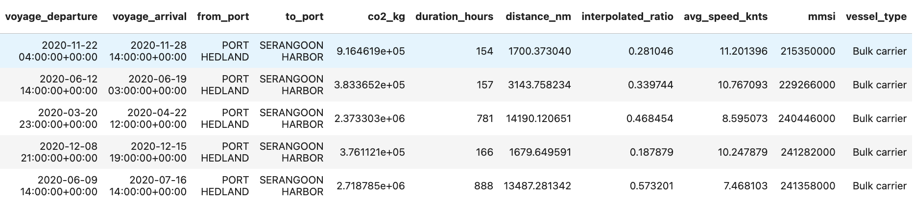
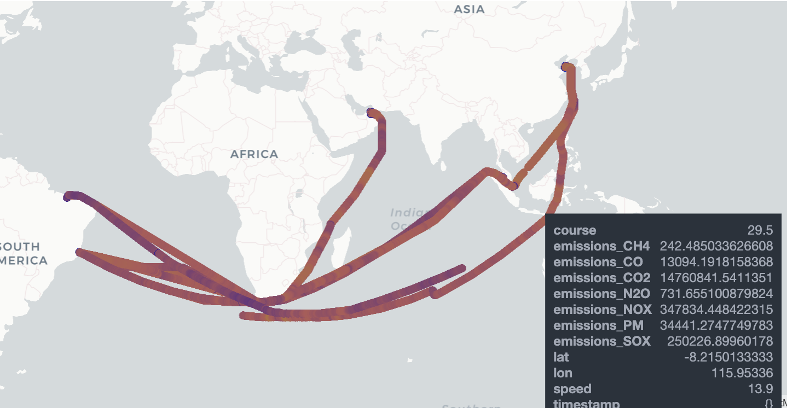

# Climate Hackathon 2022

The vessel emissions data provided by HUB Ocean and the Ocean Data Portal Consists of:

<br>***Gridded vessel emissions*** <br>
Xarray style dataset with vessel emissions and total hours per month and vessel type. Vessel types avalable are tanker, cargo, passenger, fishing and total (all vessels). The data is stored as .zarr files in the folder ```zarr/vessel_emissions_and_traffic/``` in blob storage. See Tutorial 1 for how to use.
 <br>
 
<br>***Voyage emissions tables***<br>
Pandas style dataset consisting of from/to ports and total co2 emission per vessel. The data is available as .parquet files in the folder ```parquet/voyage_tables/``` in blob storage. The voyage tables are divided into folders based on vessel categories like Container, Oil tanker, Cruice etc. See Tutorial 2 for how to get going.
<br>

<br>***Hourly emissions data per vessel***<br> 
The raw emissions data that the other datasets are derived from. It consists of timestamps, coordinates and hourly emissions in grams for CO2 and other gases to air. The data is available in a PostgreSQL database through the function ```get_emissions_from_vessel(int mmsi)```. See Tutorial 3 for how to use.
vessel_emissions_per_ship
<br>
 

To access the datasets, connection strings need to be set for these two environmental variables:
```
HACKATHON_DB_CONNECTION
```
```
HACKATHON_CONNECTION_STR
```
This is not needed if running the notebooks in the Ocean Data Connector (The jupyter lab environment in the Ocean Data Platform).


